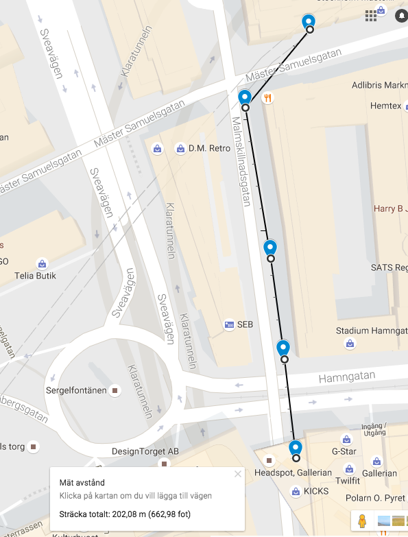

#Risky Roadtrip Analyzer
The software in this repository is a solution (hopefully) to the
[Springworks waypoint challenge](https://github.com/Springworks/recruitment-waypoints-challenge).

## Prerequisites

In order to use the analyzer the following packages are needed 
(tested version in parenthesis):
- mocha (3.12)
- Node.js (6.5.0)
- npm (3.10.7)

## Running
Install dependencies (only needed once):
```
npm install
```
Run:
```
node index -src ./data/waypoints.json -p google
```
Get help:
```
node index -h
```

### Using the Google Distance Provider
In order to use the "google" distance provider is is required to set the 
GOOGLE_MAPS_API_KEY environmental variable.

E.g. using this command on a Mac:
```
export GOOGLE_MAPS_API_KEY=YOUR_KEY_HERE
```

### Running tests
```
export GOOGLE_MAPS_API_KEY=YOUR_KEY_HERE
```

##Assumptions

- Provided data file is valid and coordinates are in WGS84
- Speeding between two waypoints is defined to occur if the speed at the origin waypoint exceeds the speed limit. Another option could be to define speeding to occur of speed exeeds speed limit at both origin and destination.
- Roadtrips are taken on roads known to Google Maps

## Results
Results differ slightly for the different distance providers. The 
"simple" one measures the distance between each waypoint while the google maps provider will align to roads.

### Simple Distance Calculation Mode


```
>node index -src ./data/waypoints.json -p simple 
Analyzing roadtrip "./data/waypoints.json" using "simple".
RESULT:
Speeding Distance: 113 meters
Speeding Duration: 10 seconds
Total Distance: 201 meters
Total Duration: 20 seconds
```

### Google Maps Distance Calculation Mode

```
>node index -src ./data/waypoints.json -p google
Analyzing roadtrip "./data/waypoints.json" using "google".
RESULT:
Speeding Distance: 113 meters
Speeding Duration: 10 seconds
Total Distance: 207 meters
Total Duration: 20 seconds
```